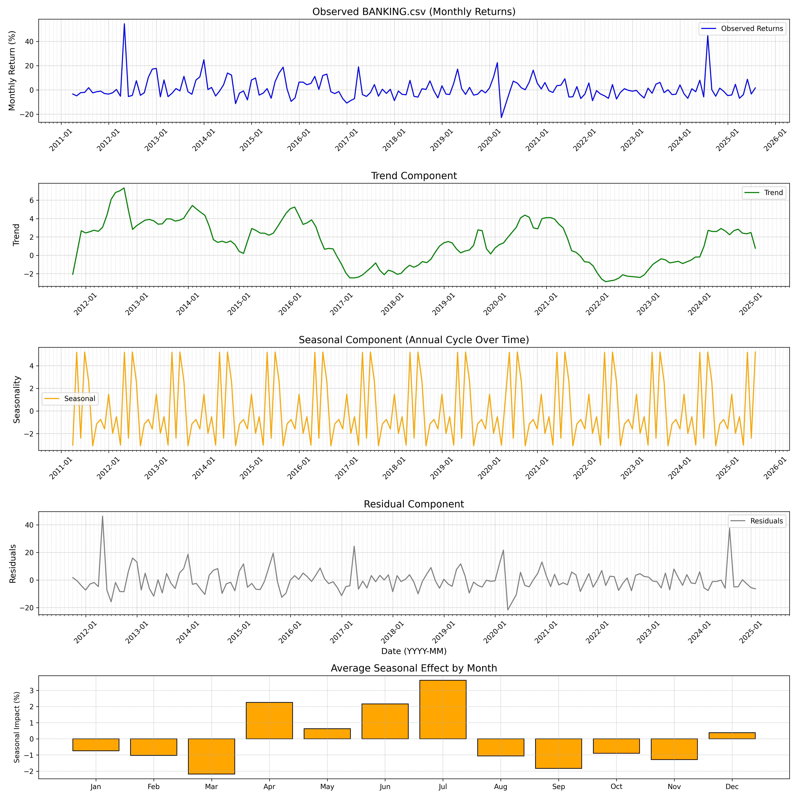
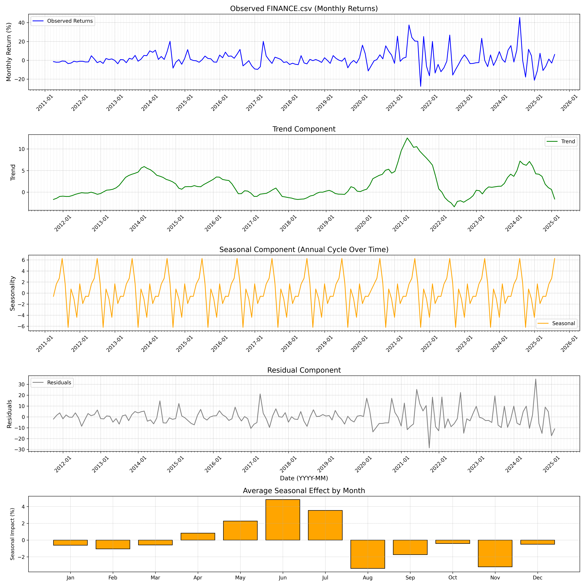
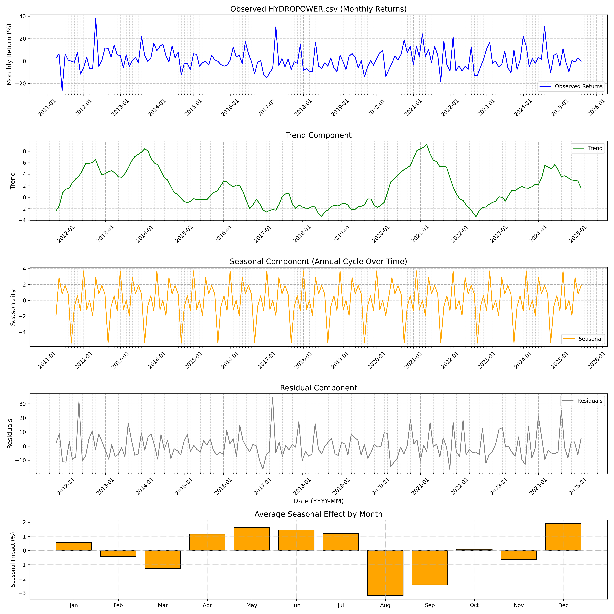
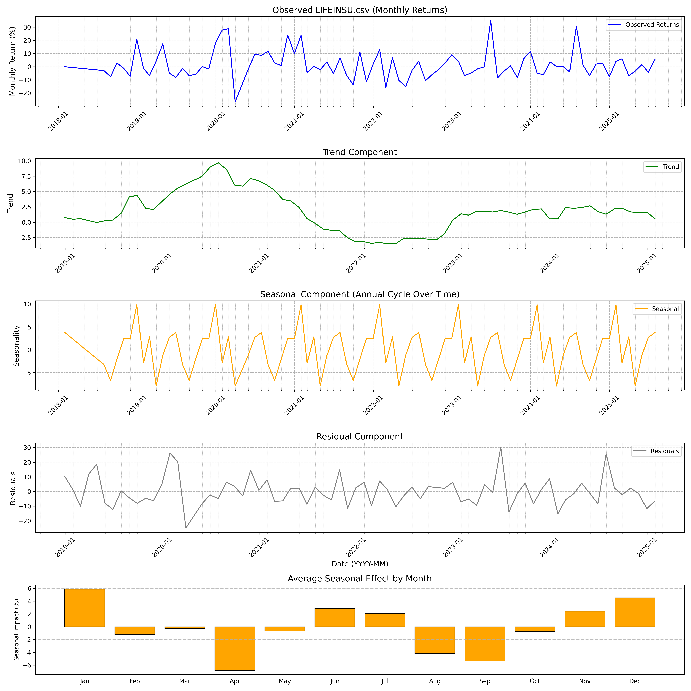
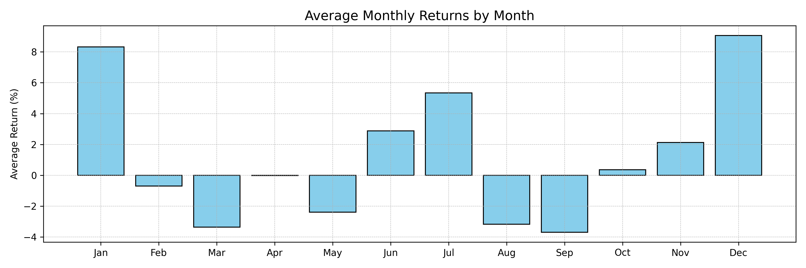
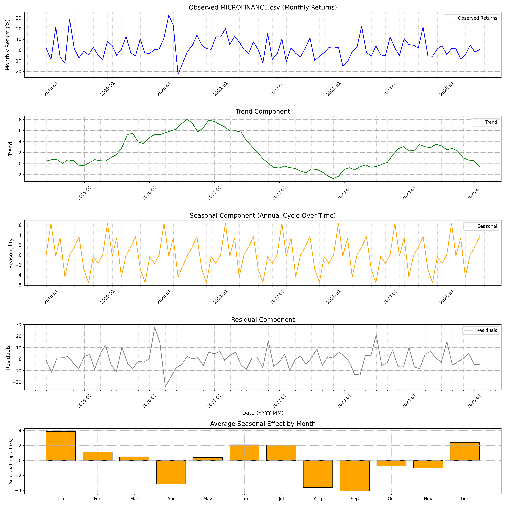
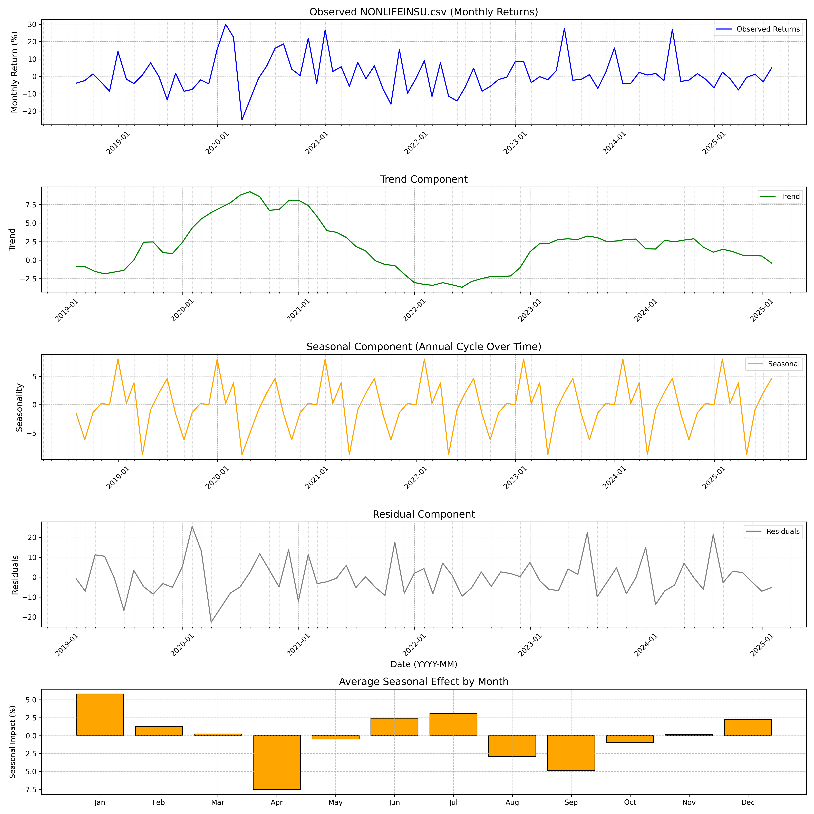
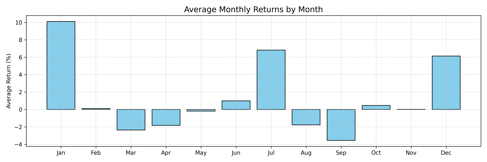
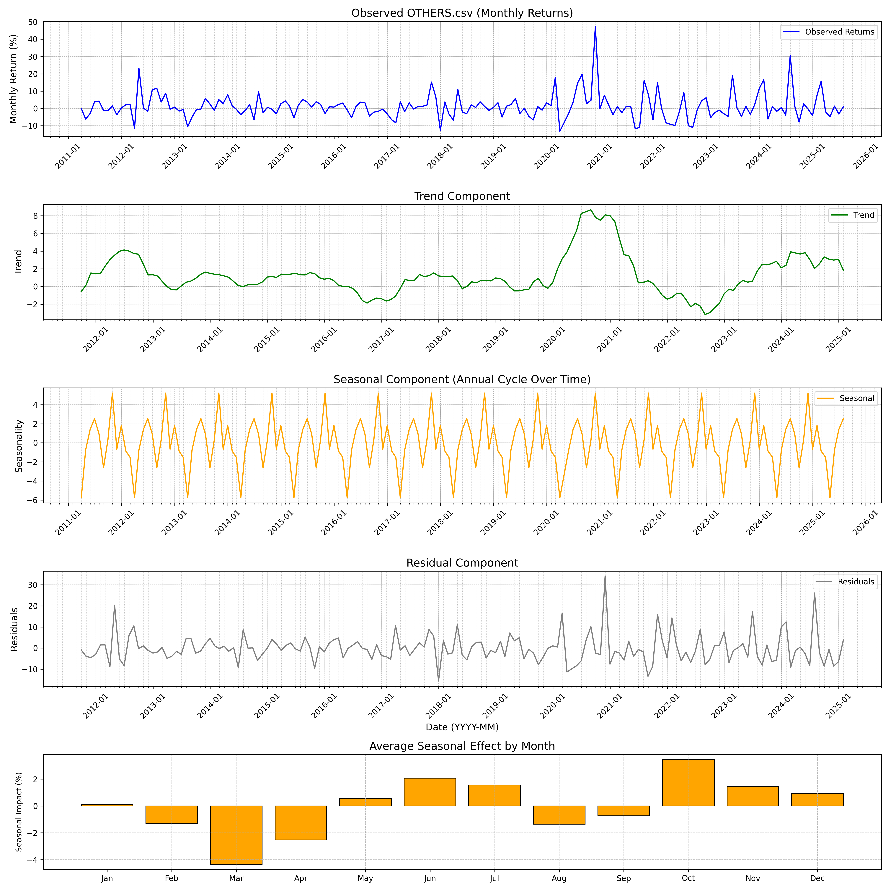
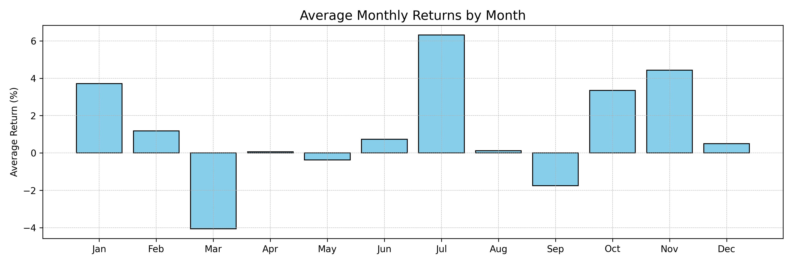

# BANKING

## Average Monthly Returns
|     |   returns |
|:----|----------:|
| Jan |      0.37 |
| Feb |      0.71 |
| Mar |     -2.16 |
| Apr |      5.01 |
| May |     -0.52 |
| Jun |      0.9  |
| Jul |      9.3  |
| Aug |     -1.77 |
| Sep |     -1.44 |
| Oct |      0.72 |
| Nov |     -0.09 |
| Dec |      2.86 |

## Average Seasonality
|     |   seasonality |
|:----|--------------:|
| Jan |         -0.74 |
| Feb |         -1.03 |
| Mar |         -2.18 |
| Apr |          2.25 |
| May |          0.63 |
| Jun |          2.16 |
| Jul |          3.63 |
| Aug |         -1.05 |
| Sep |         -1.83 |
| Oct |         -0.89 |
| Nov |         -1.28 |
| Dec |          0.39 |

---

# DEVBANK

## Average Monthly Returns
|     |   returns |
|:----|----------:|
| Jan |      5.85 |
| Feb |      1.44 |
| Mar |     -1.45 |
| Apr |      4.61 |
| May |      1.74 |
| Jun |      2.42 |
| Jul |      9.92 |
| Aug |     -0.16 |
| Sep |     -1.75 |
| Oct |      2.18 |
| Nov |     -0.22 |
| Dec |      1.39 |

## Average Seasonality
|     |   seasonality |
|:----|--------------:|
| Jan |          1.14 |
| Feb |         -0.35 |
| Mar |         -1.13 |
| Apr |          0.58 |
| May |          0.97 |
| Jun |          2.76 |
| Jul |          3.43 |
| Aug |         -1.57 |
| Sep |         -2.07 |
| Oct |         -1.07 |
| Nov |         -3.57 |
| Dec |          0.7  |

---

# FINANCE

## Average Monthly Returns
|     |   returns |
|:----|----------:|
| Jan |      4.15 |
| Feb |     -0.04 |
| Mar |      0.41 |
| Apr |      1.28 |
| May |      1.75 |
| Jun |      4.08 |
| Jul |     10.05 |
| Aug |     -1.93 |
| Sep |     -2.78 |
| Oct |      2.68 |
| Nov |     -0.57 |
| Dec |     -1.26 |

## Average Seasonality
|     |   seasonality |
|:----|--------------:|
| Jan |         -0.62 |
| Feb |         -1.05 |
| Mar |         -0.58 |
| Apr |          0.83 |
| May |          2.26 |
| Jun |          4.83 |
| Jul |          3.53 |
| Aug |         -3.38 |
| Sep |         -1.73 |
| Oct |         -0.41 |
| Nov |         -3.2  |
| Dec |         -0.49 |

---

# HOTELS

## Average Monthly Returns
|     |   returns |
|:----|----------:|
| Jan |      3.07 |
| Feb |     -2.05 |
| Mar |      5.47 |
| Apr |      2.93 |
| May |      2.13 |
| Jun |      3.43 |
| Jul |      6.4  |
| Aug |     -2.52 |
| Sep |      0.12 |
| Oct |      1.55 |
| Nov |      1.21 |
| Dec |     -0.66 |

## Average Seasonality
|     |   seasonality |
|:----|--------------:|
| Jan |         -0.08 |
| Feb |         -0.01 |
| Mar |          1.83 |
| Apr |          1.47 |
| May |          2.57 |
| Jun |          2.12 |
| Jul |          0.22 |
| Aug |         -2.44 |
| Sep |         -1.86 |
| Oct |         -1.25 |
| Nov |         -0.47 |
| Dec |         -1.8  |

---

# HYDROPOWER

## Average Monthly Returns
|     |   returns |
|:----|----------:|
| Jan |      6.78 |
| Feb |     -0.91 |
| Mar |      1.62 |
| Apr |      3.64 |
| May |      0.26 |
| Jun |      0.76 |
| Jul |      6.36 |
| Aug |     -3.06 |
| Sep |     -1.37 |
| Oct |      2.01 |
| Nov |      0.45 |
| Dec |      1.1  |

## Average Seasonality
|     |   seasonality |
|:----|--------------:|
| Jan |          0.57 |
| Feb |         -0.44 |
| Mar |         -1.28 |
| Apr |          1.16 |
| May |          1.63 |
| Jun |          1.44 |
| Jul |          1.21 |
| Aug |         -3.18 |
| Sep |         -2.43 |
| Oct |          0.09 |
| Nov |         -0.64 |
| Dec |          1.92 |

---

# INVESTMENT

## Average Monthly Returns
|     |   returns |
|:----|----------:|
| Jan |      8.49 |
| Feb |     -1.93 |
| Mar |      1.16 |
| Apr |     -2.78 |
| May |     -0.61 |
| Jun |      2.43 |
| Jul |     11.63 |
| Aug |     -5.92 |
| Sep |     -9.31 |
| Oct |      0.6  |
| Nov |     -2.39 |
| Dec |      3.25 |

## Average Seasonality
|     |   seasonality |
|:----|--------------:|
| Jan |          8.37 |
| Feb |         -5.94 |
| Mar |          0.82 |
| Apr |         -4.79 |
| May |         -2.14 |
| Jun |          2.75 |
| Jul |         16.67 |
| Aug |         -6.41 |
| Sep |         -9.72 |
| Oct |          0.24 |
| Nov |         -2.83 |
| Dec |          2.98 |

---

# LIFEINSU

## Average Monthly Returns
|     |   returns |
|:----|----------:|
| Jan |      8.33 |
| Feb |     -0.7  |
| Mar |     -3.36 |
| Apr |     -0.01 |
| May |     -2.4  |
| Jun |      2.87 |
| Jul |      5.33 |
| Aug |     -3.17 |
| Sep |     -3.7  |
| Oct |      0.36 |
| Nov |      2.12 |
| Dec |      9.06 |

## Average Seasonality
|     |   seasonality |
|:----|--------------:|
| Jan |          5.9  |
| Feb |         -1.26 |
| Mar |         -0.25 |
| Apr |         -6.81 |
| May |         -0.66 |
| Jun |          2.86 |
| Jul |          2.03 |
| Aug |         -4.21 |
| Sep |         -5.38 |
| Oct |         -0.76 |
| Nov |          2.45 |
| Dec |          4.53 |

---

# MANUFACTURE

## Average Monthly Returns
|     |   returns |
|:----|----------:|
| Jan |      1.09 |
| Feb |      1.66 |
| Mar |     -2.69 |
| Apr |      2.58 |
| May |      3.36 |
| Jun |      2.07 |
| Jul |      5.72 |
| Aug |      0.49 |
| Sep |     -1.55 |
| Oct |     -0    |
| Nov |      2.21 |
| Dec |      5.61 |

## Average Seasonality
|     |   seasonality |
|:----|--------------:|
| Jan |         -1.34 |
| Feb |         -0.54 |
| Mar |         -2.91 |
| Apr |         -0.3  |
| May |          2.95 |
| Jun |          2.49 |
| Jul |          0.49 |
| Aug |         -0.94 |
| Sep |         -1.85 |
| Oct |         -0.13 |
| Nov |          1.11 |
| Dec |          0.95 |

---

# MICROFINANCE

## Average Monthly Returns
|     |   returns |
|:----|----------:|
| Jan |     11.78 |
| Feb |     -1.55 |
| Mar |     -3.46 |
| Apr |      6.43 |
| May |      0.35 |
| Jun |      1.5  |
| Jul |      7.74 |
| Aug |     -3.46 |
| Sep |     -2.67 |
| Oct |      0.89 |
| Nov |     -0.19 |
| Dec |      3.69 |

## Average Seasonality
|     |   seasonality |
|:----|--------------:|
| Jan |          3.89 |
| Feb |          1.14 |
| Mar |          0.48 |
| Apr |         -3.14 |
| May |          0.38 |
| Jun |          2.1  |
| Jul |          2.06 |
| Aug |         -3.64 |
| Sep |         -4.07 |
| Oct |         -0.73 |
| Nov |         -1.04 |
| Dec |          2.42 |

---

# NONLIFEINSU

## Average Monthly Returns
|     |   returns |
|:----|----------:|
| Jan |     10.1  |
| Feb |      0.11 |
| Mar |     -2.37 |
| Apr |     -1.83 |
| May |     -0.18 |
| Jun |      0.99 |
| Jul |      6.82 |
| Aug |     -1.77 |
| Sep |     -3.55 |
| Oct |      0.46 |
| Nov |      0.01 |
| Dec |      6.14 |

## Average Seasonality
|     |   seasonality |
|:----|--------------:|
| Jan |          5.82 |
| Feb |          1.26 |
| Mar |          0.23 |
| Apr |         -7.53 |
| May |         -0.48 |
| Jun |          2.43 |
| Jul |          3.06 |
| Aug |         -2.94 |
| Sep |         -4.85 |
| Oct |         -0.95 |
| Nov |          0.16 |
| Dec |          2.27 |

---

# OTHERS

## Average Monthly Returns
|     |   returns |
|:----|----------:|
| Jan |      3.71 |
| Feb |      1.19 |
| Mar |     -4.06 |
| Apr |      0.07 |
| May |     -0.37 |
| Jun |      0.73 |
| Jul |      6.32 |
| Aug |      0.12 |
| Sep |     -1.76 |
| Oct |      3.35 |
| Nov |      4.43 |
| Dec |      0.5  |

## Average Seasonality
|     |   seasonality |
|:----|--------------:|
| Jan |          0.09 |
| Feb |         -1.28 |
| Mar |         -4.35 |
| Apr |         -2.54 |
| May |          0.54 |
| Jun |          2.08 |
| Jul |          1.56 |
| Aug |         -1.36 |
| Sep |         -0.74 |
| Oct |          3.46 |
| Nov |          1.43 |
| Dec |          0.92 |

---

# TRADING

## Average Monthly Returns
|     |   returns |
|:----|----------:|
| Jan |      6.19 |
| Feb |     -0.61 |
| Mar |      1.84 |
| Apr |     -2.15 |
| May |      0.1  |
| Jun |      1.5  |
| Jul |      5.56 |
| Aug |      0.12 |
| Sep |      1.01 |
| Oct |      0.08 |
| Nov |     19.35 |
| Dec |      4.58 |

## Average Seasonality
|     |   seasonality |
|:----|--------------:|
| Jan |          1.46 |
| Feb |         -0.86 |
| Mar |         -2.64 |
| Apr |         -4.48 |
| May |         -1.98 |
| Jun |          1.08 |
| Jul |          0.15 |
| Aug |         -3.7  |
| Sep |         -2.53 |
| Oct |          4.1  |
| Nov |          6.3  |
| Dec |          3.42 |

---

